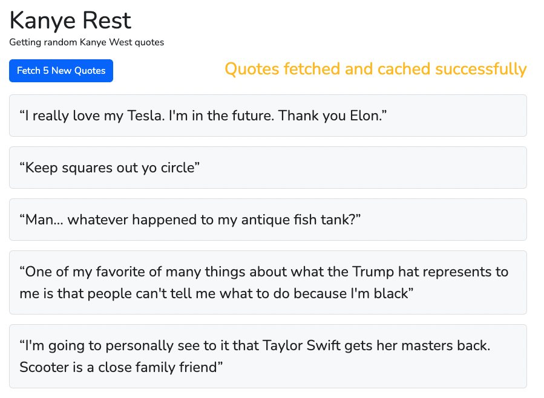

# AVRillo - Kanye Rest

A simple app that fetches random Kanye West quotes from https://kanye.rest/. It first gets all quotes and caches them. You can then fetch the next 5 random quotes from this cache.

-   Laravel v11
-   PHP v8
-   Vue v3
-   Vite v5



## Installation

Ensure Docker is running

Create new .env file copying details in .env.example

Run docker to spin up containers

```bash
docker-compose up -d
```

Install required packages

```bash
docker-compose exec app composer install
```

Generate your app key

```bash
docker-compose exec app php artisan key:generate
```

Migrate database

```bash
docker-compose exec app php artisan migrate
```

Install node packages

```bash
npm install
```

Compile and build assets for dev

```bash
npm run dev
```

Run console command to generate access keys (expires after 2 hours). Update your .env with these values.

```bash
docker-compose exec app php artisan generate-keys "appname"
```

## Run tests

```bash
docker-compose exec app php artisan test
```

## Future considerations:

-   Check for duplicate quotes
-   Switch to Redis for caching
-   Add improved validation
-   Add login for additional authentication/security
-   Fix pair authentication with use of secret
-   Improve front end with SCSS
-   Check for full test coverage
-   Refactor with consistent naming
